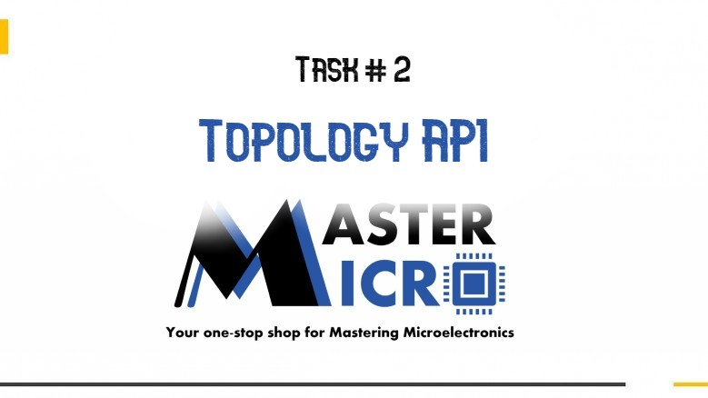
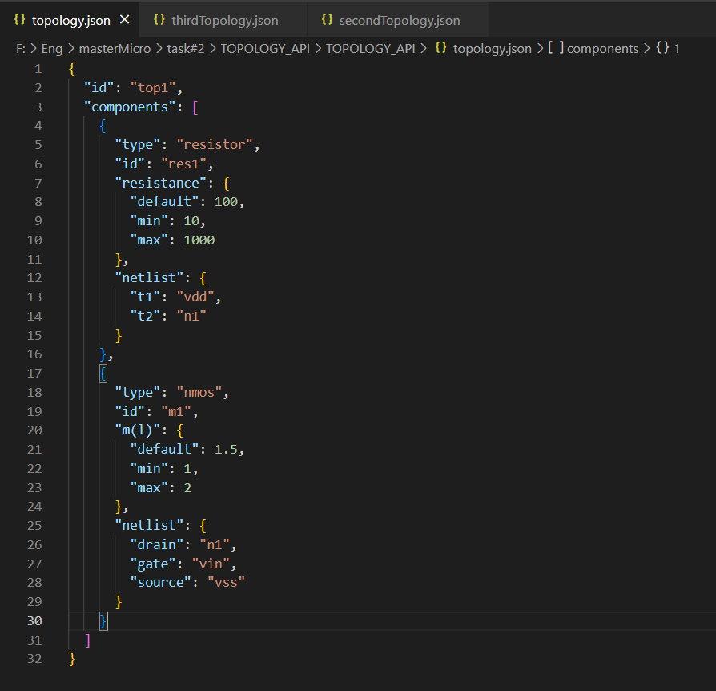

# Topology_API

<h3>Build With : </h3>
 <ul>
  <li><a href="https://www.w3schools.com/CPP/default.asp/">C++</a></li>
  <li><a href="https://visualstudio.microsoft.com/downloads/">Visual Studio 2019</a></li>
 </ul>

   
   
<h3>Getting Started</h3>
<blockquote>
  
This is an list of needed instructions to set up your project locally, to get a local copy up and running follow these instructuins.
 

</blockquote>

<h3>Description</h3>
<blockquote>
  

  This application was implemented for a task to get an internship in Master Micro Company.
   
  It is a Console app that provides the functionality to access, manage and store device topologies that are represented as JSON files.
 

</blockquote>

<h3>Documentation</h3>
<blockquote>
  

  You can see Documentation done with Doxygen tool.
  It documents API class, other classes and functions.
  Navigate to Documentation directory -> html -> index.html.
  

</blockquote>

<h2 href="#Screenshots">Screenshots</h2>
<ol>
<li>
  <h4>Example of an Topology JSON file</h4>
  
 </li>

 <li>
  <h4>Reading a topology from a specefic JSON file</h4>
  
 </li>
 <li>
  <h4>Query topologies</h4>
  
 </li>
 <li>
  <h4>Delete the only existing topology from memory then query topologies(Error no topologies exist)</h4>
  
 </li>
</ol>

<h3>Documentation Video</h3>
<blockquote>
  <a href="https://www.youtube.com/watch?v=9logSVEho48">Go to video</a>
</blockquote>

